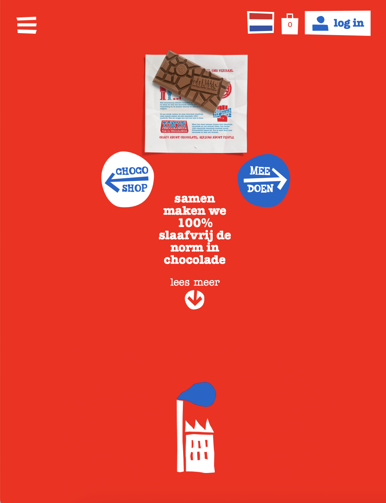
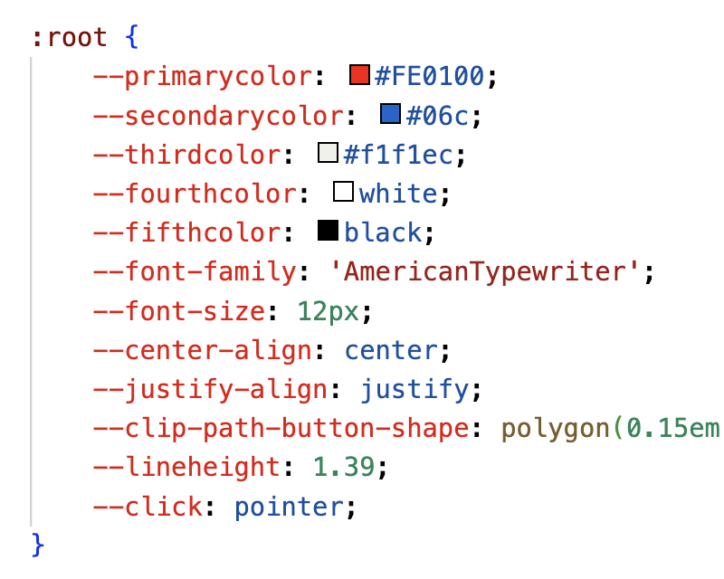

# Procesverslag
Markdown is een simpele manier om HTML te schrijven.  
Markdown cheat cheet: [Hulp bij het schrijven van Markdown](https://github.com/adam-p/markdown-here/wiki/Markdown-Cheatsheet).

Nb. De standaardstructuur en de spartaanse opmaak van de README.md zijn helemaal prima. Het gaat om de inhoud van je procesverslag. Besteedt de tijd voor pracht en praal aan je website.

Nb. Door *open* toe te voegen aan een *details* element kun je deze standaard open zetten. Fijn om dat steeds voor de relevante stuk(ken) te doen.

## Jij

  
uitwerken voor kick-off werkgroep

  ### Auteur:
  Esmé Lindeman

  #### Je startniveau:
  Rode piste/Zwarte piste. Ik oefen veel en gebruik veel code maar het lukt niet altijd. Ik ben wel op zoek naar uitdagingen en ook: kom maar op! :)

  #### Je focus:
  Surface Plane. Ik denk dat ik daar meer plezier in heb en meer van kan leren. Het liefst doe ik het allebei omdat ik ook heel graag wil leren hoe je een site responsive maak. Ik hoop dat ik het allebei kan doen zodat ik van beide opties wat kan leren en mezelf daardoor verder kan ontwikkelen. 
 

## Je website

  
uitwerken voor kick-off werkgroep

  ### Je opdracht:
  
Voor de opdracht van FED ga ik twee pagina's van de website van Tony's Chocolonely uitwerken. Ik heb gekozen voor de ['onze missie'](https://tonyschocolonely.com/nl/nl/onze-missie) pagina en de ['chocoshop'](https://tonyschocolonely.com/nl/nl/chocoshop)'chocoshop' pagina. Voornamelijk in de 'onze missie' pagina zitten uitdagingen wat betreft de surface plane, bijvoorbeeld een button die tekst laat uitklappen en een interessant animatie. De chocoshop pagina heeft een interessant kenmerk doordat er een draggable slider als tweede navigatie wordt gebruikt. Ik denk dus dat ik door deze twee pagina's na te maken veel nieuwe dingen kan leren in HTML, CSS en JavaScript.

  #### Screenshot(s) van de eerste pagina (small screen): 
  ##### Chocoshop
  

  #### Screenshot(s) van de tweede pagina (small screen):
  ##### Missie 
  

## Toegankelijkheidstest 1/2 (week 1)

  
In de eerste week van FED hebben we een toegankelijkheidstest gedaan. De website van Tony's Chocolonely kwam daar redelijk goed uit maar uiteraard zijn er verbetermogelijkheden door te voeren. Hieronder zijn mijn bevindingen te lezen

  ### Bevindingen
  #### CONCENTRATIEPROBLEMEN 
  
Gebruikers met aandoeningen als ADHD hebben moeite met concentreren. Voor deze gebruiker is de site van Tony's onoverzichtelijk. Wel is er een duidelijke structuur wat wel weer zorgt voor meer overzicht op de website. De teksten zijn niet te lang en makkelijk te volgen, ook voor iemand met bijvoorbeeld ADHD. Audio en Video spelen niet automatisch af, wat zorgt voor rust op de website. De problemen die iemand met een aandoening als ADHD kan tegenkomen op deze website zijn de volgende. Er gebeurt heel veel en er is veel beweging op de website, de animaties maken de website aantrekkelijk maar niet voor iemand met concentratieproblemen. Er is nu geen mogelijkheid om deze animaties stil te zetten, dit is een belangrijk punt om te verbeteren zodat de website toegankelijker wordt voor deze gebruikersgroep. De navigatie - zeker in het hamburger menu - heeft heel veel elementen. Er wordt wel wat meer structuur aangebracht door de verschillende onderdelen van de website weer te geven met een specifieke kleur op de achtergrond (zie afbeelding).  

  

  #### Visuele beperking
  
Tijdens het maken van de breakdown schets kwam ik erachter dat er ook een aantal dingen wat minder zijn aan de website, zo ook voor gebruikers met een visuele beperking. Zo zijn er veel images met tekst erin (als image dus) waardoor de screenreader deze tekst niet zal oplezen, wat vervelend is voor mensen met een visuele beperking. Hier valt veel aan te verbeteren, dit zijn daarnaast ook veranderingen die makkelijk te implementeren zijn. Voor de maker is er een relatief simpele oplossing voor maar voor de persoon met een visuele beperking is het een wereld van verschil, de website is namelijk veel beter te begrijpen als dit aangepast wordt. De ALT tekst is over het algemeen goed op de website. De meeste images hebben een alt text die overeen komt met de inhoud van de image. Helaas gaat het nog niet bij alle images goed en is er dus nog mogelijkheid tot verbetering. Ook zijn op de chocoshop pagina veel plaatjes gebruikt als buttons, deze hebben dus geen alt tekst en worden door de screenreader uitgesproken als 'button link' terwijl er tekst staat op de image die wel relevant is. De screenreader werkt aardig, maar is nog wat chaotisch. Dit komt zeker ook door de opbouw van de site omdat er veel plaatjes en animaties gebruikt worden, maar door de code netter weer te geven zal de screenreader ook beter werken. De site is nu goed te bedienen met alleen het toetsenbord. Tot slot heb ik nog een kleine kleuren contrast test gedaan. De site bevat namelijk veel rode achtergronden met witte tekst. via['een contrast tester'(https://www.siegemedia.com/contrast-ratio#%23fff-on-%23fe0100)
kwam eruit dat het contrast wit op rood een 4.02 scoort. Waar je eigenlijk minimaal een 4.5 wil scoren. Ik kan niet de huisstijl van de site aanpassen maar wil hier wel rekening mee houden in mijn versie van de website.
  

  #### Slechthorenden
  
Voor slechthorenden zijn de resultaten wisselend. In eerste instantie was ik hier positief over tijdens de test. De video die ik bekeek op de website heeft namelijk ondertiteling, wat prettig is voor slechthorenden. . Daarna ging ik verder kijken en kwam ik nog een video tegen, deze had helaas geen ondertiteling.  dus ook hier valt nog wat te verbeteren voor de website. Een website zou hier sowieso consequent in moeten zijn. Op de pagina's die ik ga namaken is dit iets minder relevant omdat er geen video's zijn maar het is wel belangrijk om hier de waarde en het belang van in te zien. Door de test weet ik nu dat ik hier bij het maken van een site rekening mee moet houden. 

  #### Lichamelijke beperkingen
  
Voor gebruikers met lichamelijke beperkingen als spierziekten of parkinson etcetera is het gebruik van een website ook niet altijd makkelijk. Op de site van Tony's is het mobiele scherm voornamelijk lastig te bedienen. Alle elementen op deze pagina zijn namelijk draggable sliders. Ook voor slechtzienden is dit niet heel toegankelijk overigens, want het ik vond het ook niet meteen duidelijk dat je deze horizontaal kunt scrollen. De plaatjes zijn daarnaast vrij klein. Zowel voor slechtzienden als voor gebruikers met lichamelijk beperkingen zijn die sliders en de kleine afbeeldingen niet ideaal. Daarom wil ik een oplossing zoeken om het gebruik van deze sliders te beperken. 

### Conclusie

  Ten opzichte van vele grote sites scoort Tony's redelijk goed, je ziet en merkt dat er nagedacht is over toegankelijkheid. Je merkt echter ook dat er niet altijd heel secuur mee om is gegaan en dat het niet de hoofdfocus is geweest. Er valt dus nog zeker wat te verbeteren aan de site, en daarmee ga ik graag aan de slag. 

## Breakdownschets (week 1)

  
Voordat we beginnen met coderen maken we een breakdownschets. Door het maken van deze breakdownschets krijg je een duidelijk beeld van de elementen op de website. Zo krijg je een schematisch overzicht waar je op kunt terugvallen als je het overzicht tijdens het coderen even kwijt bent.

  ### de hele pagina - missie: 
  
  
De eerste pagina is opgedeeld in veel secties die heel veel van elkaar weghebben. Ik heb ervoor gekozen dit niet allemaal uit te werken omdat het best wel op hetzelfde neer komt allemaal. Ik focus me dan liever op andere belangrijke dingen dan dat ik 4x dezelfde sectie ga coderen. Wel vind ik de 'start' animatie en de uitklap sectie belangrijk om uit te voeren.

  ### de hele pagina - chocoshop: 
  
  
Dit is een productpagina, wat betekent dat ook hier veel dezelfde elementen terugkomen. Daarom. heb ik een groot deel van de pagina weggelaten om dezelfde reden als bij de andere pagina. Ik doe dan liever een kleiner deel met volle aandacht en daarnaast denk ik dat het weinig toevoegt als ik dus heel veel hetzelfde uitwerk. 

## Eerste Code (week 1)

Ik ben alvast begonnen met wat code schrijven om te kijken hoe het is om de website na te maken. Ik ben begonnen met wat variabelen aanmaken en de navigatie aan te maken. Dit ziet er nu zo uit als hieronder te zien is in de screenshot.

## Origineel op de pagina van Tony's Chocolony

## Mijn eerste poging tot het namaken van de navigatie

Ik was al aardig op weg met de navigatie. Toen werd mij verteld dat ik beter mobiel kan beginnen omdat het makkelijker is om op te schalen en groter te maken dan andersom. Daarom ben ik opnieuw begonnenn met de navigatie. Alle elementen heb ik in een ul, li en daarbinnen weer een ul met li's gezet. Voor het hamburger menu heb ik opgezocht hoe ik dit het beste kan doen, ik heb veel geprobeerd maar niet alles werkte. De uitleg van W3 schools werkte maar gebruikte Javascript. Er wordt aangeraden zo min mogelijk javascript te gebruiken dus heb ik ervoor gekozen deze niet te gebruiken. Uiteindelijk heb ik de volgende gebruikt (https://alvarotrigo.com/blog/hamburger-menu-css/ "Uitleg hamburgermenu") en dit gaf in eerste instantie het volgende resultaat 

## Werkgroep 2 - verder met de code

Ik ben begonnen met de animatie maken van de chocoladeletter. In de code van de website zie ik dat het allemaal losse plaatjes zijn die overgaan in elkaar. Ik ben gaan opzoeken hoe ik dit kan doen met code. https://chat.openai.com/c/f5ce79e8-4cc9-4292-a9f5-6cf819249248 

## Voortgang 1 (week 2)

  
Na week één en twee heb ik veel werk verricht maar nog weinig werkende dingen. Hieronder kun je mijn eerste week FED zien. 

  ### Stand van zaken
  
 Ik heb eerst de 'fout' gemaakt om te beginnen met een groot scherm, waardoor ik opnieuw kon beginnen. Ik heb veel geleerd over CSS en een navigatie maken dus echt een fout is het natuurlijk niet want ik heb er wel weer nieuwe dingen geleerd, het was alleen voor dit project niet heel handig.
Daarna ben ik veel aan de slag gegaan met de animatie en het hamburgermenu. Ik heb hier veel tijd in gestopt   maar ik had hier nog helemaal niet mee aan de slag moeten gaan. De animatie kreeg ik telkens niet werkend of niet op de goede plek en het hamburger menu begreep ik helemaal weinig van. Ik had ook niet de juiste aanpak. Ik heb een menu'tje gemaakt met een paar elementen en wilde deze toen meteen kunnen inklappen. Hierdoor werd het een beetje een puinhoop en raakte ik het overzicht totaal kwijt. Ik heb dus eigenlijk een week aan werk 'verspild' dus ik moet in de aankomende weken wat meer tempo gaan maken. 

  ### Verslag van meeting
  
Na het gesprek met de studentassistent kwamen we tot de conclusie dat ik veel aan het proberen ben maar dat ik ook nog wel veel te doen heb. Ik heb gezegd dat ik het wel prima ga redden. Als tip kreeg ik om wel ook mijn read-me goed bij te houden omdat dat niet heel fijn is om aan het einde allemaal nog te doen. De read-me in markdown schrijven is in mijn hoofd nogal een uitdaging omdat het veel werk lijkt, daarom hou ik vanaf nu mijn werk goed bij in notion zodat ik het in grote delen in markdown kan zetten en tussen het coderen door even snel een aantekening kan maken in notion. Dat werkt een stuk beter voor mij. 

  hier na afloop snel de uitkomsten van de meeting vastleggen

## Voortgang 2 (week 3)

  
In week 3 heb ik al mijn code weggeggooid en ben ik opnieuw begonnen. Deel van de opdracht is om nette vanilla HTML en CSS te schrijven en dat had ik simpelweg niet. Als ik mijn eigen code al niet meer kan begrijpen kan natuurlijk niemand het begrijpen. Ik merkte dat ik echt vastliep en dat ik er beter aan zou doen om gewoon opnieuw te beginnen met de kennis die ik heb opgedaan in de eerste twee weken. Ik weet nu in ieder geval hoe het niet moet. 

  ### Stand van zaken
  #### Hier was ik

Op het punt van 'ik begin opnieuw' had ik al de basis van de site. En met basis bedoel ik basis :)  Ik had dus wel wat, maar het stond totaal niet overzichtelijk. Ik had veel onnodige sections, classes en divs in mijn code.

#### CSS

In mijn CSS was het overzicht ook steeds meer te zoeken. Ik had het heel netjes ingedeeld per header etc en had veel variabelen aangemaakt. Tegelijkertijd dacht ik ook dat ik wel alvast iets responsive kon maken, wat niet kon en niet werkte.  Nou kortom, het ging niet helemaal lekker. Tijd om even te refreshen.

#### Variabelen

Mijn variabelen had ik wel al op orde. Hiermee kan ik dus snel en makkelijk aan de slag. Ik heb wel wat kleuren toegevoegd en nog wat andere variabelen aangemaakt.  De basis staat nu dus goed. 

#### Het proces verder
##### Button die een section laat uitklappen

De buttons met 'lees meer' klappen uit en geven dan meer informatie. Ik wil dit eerst los even maken zodat ik alleen kan focussen op dit stukje. Ik heb een test.html aangemaakt waarin ik alleen even kan testen hoe het uitklappen van een button werkt. De essentie is dus: er moet een section uitklappen als ik klik op een button. Ik heb eerst de hele uitklapsectie gemaakt. Hier heb ik een verandering ingebracht. Ik vind de uitklap namelijk onoverzichtelijk door verschillende lettertypen en grootten. Daarom heb ik dit allemaal gelijk getrokken om het toegankelijker te maken, zeker voor gebruikers met bijvoorbeeld concentratieproblemen. In eerste instantie heb ik deze JavaScript gebruikt. Hiermee klapte het wel uit als ik klikte op de button maar ging al mijn andere content weg. Er klapte dus wel wat uit maar nog niet helemaal op de manier hoe ik het wilde.  

##### draggable slider

Zoals bij de eerste toegankelijkheidstest naar voren kwam heb ik opgemerkt dat er in de chocoshop pagina veel (lees: bijna alleen maar) draggable sliders voorkomen. Deze moet je dus pakken, blijven klikken en dan slepen. Qua toegankelijkheid scoort dit natuurlijk een 0, want dit is heel moeilijk tot niet te besturen met alleen je toetsenbord. Ik heb daarom voor andere oplossingen gekozen.

###### De tweede navigatiebalk

De pagina heeft een draggable slider als tweede navigatie. Eigenlijk is dit een soort filter systeem, maar het leidt je wel naar andere pagina. Daarom heb ik dit wel gedefinieerd als een tweede navigatie. Bij deze slider is het lastig er wat anders van te maken zonder het hele ontwerp compleet om te gooien. Daarom heb ik er voor deze gekozen de navigatie scrollable te maken. Nu kun je deze ook makkelijk besturen met je toetsenbord. Daarnaast komt er nu bij beweging een scrollbar in beeld, waardoor meteen duidelijk is dat er meer content zit als je horizontaal scrollt, waar eerst niet helemaal duidelijk was dat je uberhaupt iets kon scrollen of slepen.

###### De andere sliders

Zoals eerder aangegeven is de website onoverzichtelijk op het moment. Het is niet duidelijk wat er te scrollen is en hoe het werkt. Ik heb er daarom voor gekozen om deze draggable sliders er helemaal uit te halen en er een grid voor in de plaats te maken met maximaal twee items naast elkaar. Dan is de site een stuk toegankelijker, overzichtelijker en beter te begrijpen.

###### Images met tekst

Er zijn veel linkjes die weergegeven worden als image, wat prima is. Alleen is de alt tekst dan niet kloppend. Op onderstaand plaatje wordt namelijk geen tekst uitgesproken door de screenreader, terwijl er wel belangrijke informatie opstaat voor het navigeren. Ik heb dus twee opties. 1: de tekst als heading of als paragraph op het plaatje zetten of 2: een alt tekst toevoegen. Hoewel ik optie 1 beter zou vinden, kies ik nu voor optie 2 omdat dat een stuk sneller is en ook toegankelijk is. Daarnaast zou ik bij meer tijd voor de images ook gewoon een clippath gebruiken ipv een vooraf geclipte image gebruiken maar dat zijn details. Voor nu gebruik ik de op de website gebruikte content.  

##### Background Skew

In de huisstijl van Tony's zitten veel ongelijke en scheve vormen. Zo ook in het uitklapmenu. Hiervoor heb ik een lineair gradient gebruikt en heb ik iets nieuws geleerd. Namelijk door in het algemene element een variabele te plaatsen, die dan anders is per element. Hiermee hoef je dus niet voor ieder list item opnieuw de lineair gradient te bepalen.

#### Carrousel

De verpakking op de missie pagina die openklapt heeft mijn leven ongeveer vijf jaar verkort. Ik ben hier heeel lang mee bezig geweest en kreeg het maar niet goed. Had ik de animatie kloppend, was het weer voor geen meter op de juiste plaats te krijgen. Ook werkte het eerst heel langzaam, of stopte de animatie niet met afspelen. Kortom: groot gedoe. Dit heeft dan ook heel veel tijd gekost.

##### Poging 1
Definieer alle afbeeldingen die inde carousel moeten komen:
 const images = [
   'images/missie_0001.jpg',
//   'images/missie_0002.jpg',
//   'images/missie_0003.jpg',
//   'images/missie_0004.jpg',
//   'images/missie_0005.jpg',
//   'images/missie_0006.jpg',
//   'images/missie_0007.jpg',
//   'images/missie_0008.jpg',
//   'images/missie_0009.jpg',
//   'images/missie_0010.jpg',
//   'images/missie_0011.jpg',
//   'images/missie_0012.jpg',
//   'images/missie_0013.jpg',
//   'images/missie_0014.jpg',
//   'images/missie_0015.jpg',
//   'images/missie_0016.jpg',
//   'images/missie_0017.jpg',
//   'images/missie_0018.jpg',
//   'images/missie_0019.jpg',
//   'images/missie_0020.jpg',
//   'images/missie_0021.jpg',
//   'images/missie_0021.jpg',

// ]
// // tijd in milliseconden tussen de overgang naar een andere afbeelding:
// const timeOut = 150
// // Boolean of de carousel moet doorgaan naar de eerste afbeelding nadat de laatste afbeelding bereikt is:
// const loop = true

// // Het HTML element van de carousel:
// const carouselContainer = document.querySelector('.image-carousel')

// // teller die bijhoudt wat de huidige afbeelding is:
// // NB het 1e element van een array is 0 het laatste is n-1 waar n het aantal elementen uit de array is
// let ix = 0

// // De functie die er voor zorgt dat de juiste afbeelding getoond wordt:
// function carousel() {
//   // gebruik de afbeelding die volgens ix de huidige is:
//   carouselContainer.style.backgroundImage = `url('${images[ix]}')`
//   // hoog ix op met 1:
//   ix++
//   // als ix nu gelijk is aan het aantal afbeeldingen 
//   // en er is aangegevene dat er een loop moet zijn, 
//   // zet dan de teller weer op 0 (de 1e afbeelding)
//   if (ix === images.length && loop) ix = 0
//   // als de teller niet hoger is dan het aantal afbeeldingen,
//   // roep dan deze functie opnieuw aan
//   if (ix+1 < images.length) setTimeout(carousel, timeOut)
// }

// // start deze code als het hele HTML document is ingeladen in de browser:
// window.onload = () => {
//   //teller die bijhoudt hoeveel afbeelding zijn ingeladen:
//   let loaded = 0

//   // preload alle afbeeldingen zodat de gebruikerservaring beter wordt:
//   for (const src of images) {
//     const img = new Image()
//     // als de image is ingeladen door de browser, hoog dan de teller op met 1:
//     img.onload = () => {
//       // als alle agbeeldinge zijn ingeladen, start dan de carousel:
//       if (++loaded === images.length) {
//         carousel()
//       }
//     }
//     img.src = src
//   }
// }
##### Poging 2
// const imageSources = [
//   'img1.jpg',
//   'img2.jpg',
// ]
// const timeOut = 200
// const loop = false //true = door, false = stopt
// let images = Array.from(document.querySelectorAll('.image-carousel img'))
// let img
// function carousel() {
//   if (img) img.classList.toggle('current')
//   img = images.shift() //eerste element van de array - daarna is de array 1 korter (20 ipv 21)
//   img.classList.toggle('current') //voor het plaatje dat je net hebt gepakt
//   if (loop && !images.length) {
//     images = Array.from(document.querySelectorAll('.image-carousel img'))
//   }
//   if (images.length) setTimeout(carousel, timeOut)
// }
// window.onload = () => {
//   imageSources.forEach(src => {
//     const img = new Image()
//     // preloaden images, zelf even opzoeken
//   })
//   setTimeout(carousel, timeOut)
// }
##### Poging 3
de vele tussenpogingen zal ik niet allemaal meenemen, dan wordt het een heel lang bestand. Uiteindelijk is het gelukt met behulp van mijn vader met de volgende code.

const images = [];
const delay = 100
for (let i = 1; i <= 21; i++) {
images.push(`images/missie_00${i < 10 ? 0 : ''}${i}.jpg`)
}
// Het HTML element van de carousel:
const wikkelContainer = document.querySelector('.wikkel')
function next() {
const img = document.querySelector('img.current')
if (img.nextSibling) {
img.classList.remove('current')
img.nextSibling.classList.add('current')
if(img.nextSibling.nextSibling) setTimeout(next, delay)
}
}
window.onload = () => {
//teller die bijhoudt hoeveel afbeelding zijn ingeladen:
let loaded = 0
// preload alle afbeeldingen zodat de gebruikerservaring beter wordt:
for (const src of images) {
const img = new Image()
wikkelContainer.appendChild(img)
// als de image is ingeladen door de browser, hoog dan de teller op met 1:
img.onload = () => {
// als alle afbeeldingen zijn ingeladen, start dan de carousel:
if (++loaded === images.length) {
wikkelContainer.classList.remove('loading')
wikkelContainer.querySelector('img').classList.add('current')
setTimeout(next, delay)
}
}
img.src = src
}
}

  ### Verslag van meeting
  
Het gaat goed maar ik moet mijn tijd wat meer besteden aan de hoofdlijnen. Ik blijf lang hangen bij details waardoor ik nu eigenlijk nog maar één pagina af heb en er is niet veel tijd meer. Ook aan de toegankelijkheid moet ik nog iets meer aandacht besteden.

## Toegankelijkheidstest 2/2 (week 4)

  
uitwerken na test in 9e werkgroep

  ### Bevindingen

De toegankelijkheid op de website is er toch wel flink op vooruit gegaan. Waar ik eerst dacht dat de site wel aardig scoorde kwam ik er na verloop van tijd toch achter dat dit niet helemaal waar was. De algemene dingen staan goed, maar veel elementen zijn helemaal niet makkelijk te bedienen.

#### Concentratieproblemen

Een deel van de animaties heb ik weggelaten. Ze voegen niet veel toe want het eindigt in de image die ik heb gebruikt. Zo wordt het al een stuk rustiger voor gebruikers met concentratieproblemen. De animaties kunnen stilzetten was helaas een stapje te moeilijk voor mij, maar in de toekomst wil ik hier wel mee aan de slag. Het hamburgermenu heb ik zo gemaakt dat alle onderdelen die bij elkaar horen op dezelfde kleur achtergrond staan zodat - eigenlijk voor iedere gebruiker - veel duidelijker is wat de verschillende onderdelen zijn. 

 #### Visuele beperking 
 
Alle images hebben een kloppende alt tekst, zo ook de illustraties. De SVG's, buttons, divs etc hebben een aria-label zodat ook de screenreader deze kan lezen in plaats van dat er alleen 'link button' wordt gezegd. De inhoud van de buttons, ook als dit als image getoond wordt, wordt nu opgelezen door de screenreader. Uit de eerste test kwam een relatief lage score voor het contrast niveau. Dit ging om witte tekst op een rode achtergrond. Daarom heb ik een media query  toegevoegd waarmee gebruikers een 'dark mode' kunnen instellen. Deze dark mode wordt echter niet donkerder maar wordt wel overzichtelijker doordat het een witte achtergrond wordt met zwarte tekst. Ik heb geen tijd gehad om de website responsive te maken maar wilde wel al wat leren over media query's. 

  #### Slechthorenden
  
Voor slechthorenden ondervond ik weinig tot geen problemen op de delen van de site die ik heb nagemaakt. Daarom heb ik dan ook geen verbeteringen geimplementeerd. 

  #### Lichamelijke beperkingen
  
Zoals eerder beschreven zijn er voor deze gebruikers veel problemen. Op de missie pagina is relatief makkelijk te navigeren en gaat het redelijk goed. Een kleine verandering die ik heb toegevoegd is het uitklappen van de 'lees meer' sectie. In de originele site verandert de button in het uitklapdeel en kun je deze alleen sluiten met de kleine sluit knop. Ik heb deze knop al groter gemaakt en daarnaast kun je ook gewoon weer op de 'lees meer' knop klikken om de sectie te sluiten omdat dit sos de logische stap is in plaats van een button die makkelijk over het hoofd gezien kan worden. 

  
Op de chocoshop heb ik heel veel veranderingen doorgevoerd. Deze site was voor mij - zonder (bekende) beperkingen - al vrij onoverzichtelijk en moeilijk te bedienen. Deze pagina was ook niet te bedienen met het toetsenbord kwam ik achter omdat er dus allemaal draggable sliders worden gebruikt waarbij je moet blijven klikken om te navigeren. Niet handig dus. Ik heb daarom zelf een oplossing bedacht waardoor te site veel overzichtelijker is en beter te bedienen, zowel met toetsenbord als op de normale manier. Van de tweede navigatie heb ik een horizontale scrollbar gemaakt en de overige elementen heb ik met grid weergegeven zodat alles gewoon te zien is op de site. Ook heb ik images met tekst erin zelf als tekst weergegeven of duidelijk omschreven met alt tekst. 

  ##### before and after chocoshop
  

  before: 
  
   Deze tekst is dus een image op de originele website
   Deze slider moet je slepen ipv scrollen 
  

  

  after:
  
  
  
  

  

## Voortgang 3 (week 4)

  
uitwerken voor 3e voortgang

  ### Stand van zaken
#### Organiseren

van beide pagina's staat alles nu. Voor nu vind ik het belangrijk om mijn code nog eens door te kijken en te bekijken wat er weg kan. Ik heb veel gekloot met CSS - voornamelijk met de animaties, grid en flexbox en de juiste positionering - waardoor ik verwacht dat er nog best wat overbodige dingen in staan. Ook verwacht ik dat ik ook nog wel wat classes weg kan halen uit mijn HTML omdat ik deze best zonder class kan aanspreken in mijn CSS. 

Conclusie: dat was zo. Ik heb zeker 20 regels weg kunnen halen. Veel dingen die inderdaad te maken hadden met positioneren. Waaronder bijvoorbeeld display:flex op elementen waarvan de parent deze moest hebben dus die deden helemaal niets. 

#### Valideren

Ik ben mijn code gaan valideren in de W3C validator. Daar kwamen nog een aantal fouten aan. Zo stonden mijn buttons niet goed. Ik heb buttons die linken naar een andere pagina. Dit had ik gedcodeerd als een button. met daaron een a en daarin een image. Dit kwam uit mijn validator als fout, waarna ik het heb aangepast. nu heb ik het gedaan als button met een onclick function die verwijst naar de pagina waar ik heen moet.

##### Een onduidelijke fout

Ik heb nog steeds 3 fouten staan die gaan over hetzelfde stuk, namelijk de navigatie in het hamburger menu. Er staat dat er open elementen zijn en dat de ul unclosed is maar volgens mij staat dit gewoon goed. Ik heb meerdere dingen geprobeerd om het op te lossen maar het staat er nog helaas.

## Eindgesprek (week 5)

  
uitwerken voor eindgesprek

  ### Je uitkomst - karakteristiek screenshots:
  
  
  
  
  

  ### Dit ging goed/Heb ik geleerd: 
Ik heb heel veel geleerd. Ik heb grid geleerd, media query's, custom property's, animaties, nieuwe hover states etc. 

  ### Dit was lastig/Is niet gelukt:
  Helaas had ik niet meer de tijd om mijn site responsive te maken. 
  Lastig waren de animatie van de uitpakkende chocoladereep, het hamburger menu en de javascript. 

## Bronnenlijst

  
continu bijhouden terwijl je werkt

  Nb. Wees specifiek ('css-tricks' als bron is bijv. niet specifiek genoeg). 
  Nb. ChatGpT en andere AI horen er ook bij.
  Nb. Vermeld de bronnen ook in je code.

  1. ChatGPT - ondersteuning bij vragen
  2. Validator - (https://validator.w3.org/)
  3. Toetsenbord navigatie - (https://help.gnome.org/users/gnome-help/stable/keyboard-nav.html.nl)
  4. Mark down - (https://github.com/adam-p/markdown-here/wiki/Markdown-Cheatsheet#links)
  5. Images van Tony - (https://extract.pics)
  6. Contrast checker - (https://www.siegemedia.com/contrast-ratio#%23fff-on-%23fe0100)
  7. Custom Properties - (https://dlo.mijnhva.nl/content/enforced/536499-FDMCI-2000FED121-DMCI-CMD-2324-2/FED%2023-24%20-%20Blok%202%20-%20Intro%20custom%20properties.pdf)
  8. Flexbox Froggy
  9. CSS diner
  10. dark mode - (https://dlo.mijnhva.nl/content/enforced/536499-FDMCI-2000FED121-DMCI-CMD-2324-2/FED%2023-24%20-%20Blok%202%20-%20Intro%20light-dark.pdf)
  11. dark mode - (https://developer.mozilla.org/en-US/docs/Web/CSS/@media/prefers-color-scheme)
  12. HTML button as a link - (https://sentry.io/answers/how-do-i-create-an-html-button-that-acts-like-a-link/)
  13. Javascript - Mark Lindeman
  14. Draggable slider - (https://www.youtube.com/watch?v=as01ehtBN0Y&t=135s)
  15. Uitklap tekst - (https://html-site.nl/uitklappen-tekst/)
  16. Hamburger menu - (https://www.w3schools.com/howto/howto_js_mobile_navbar.asp)
  17. Hamburger menu - (https://dev.to/ljcdev/easy-hamburger-menu-with-js-2do0)
  18. Hamburger menu - Marten
  19. Counter - ChatGPT
  20. font-face - (https://developer.mozilla.org/en-US/docs/Web/CSS/@font-face)
  21. clip-path - (https://developer.mozilla.org/en-US/docs/Web/CSS/clip-path)

